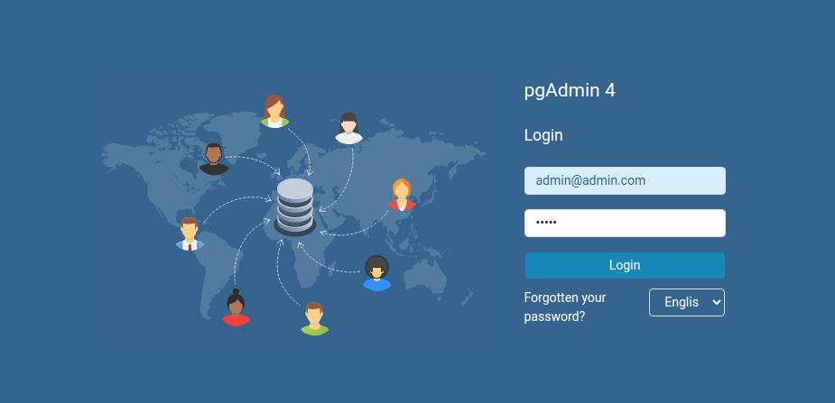
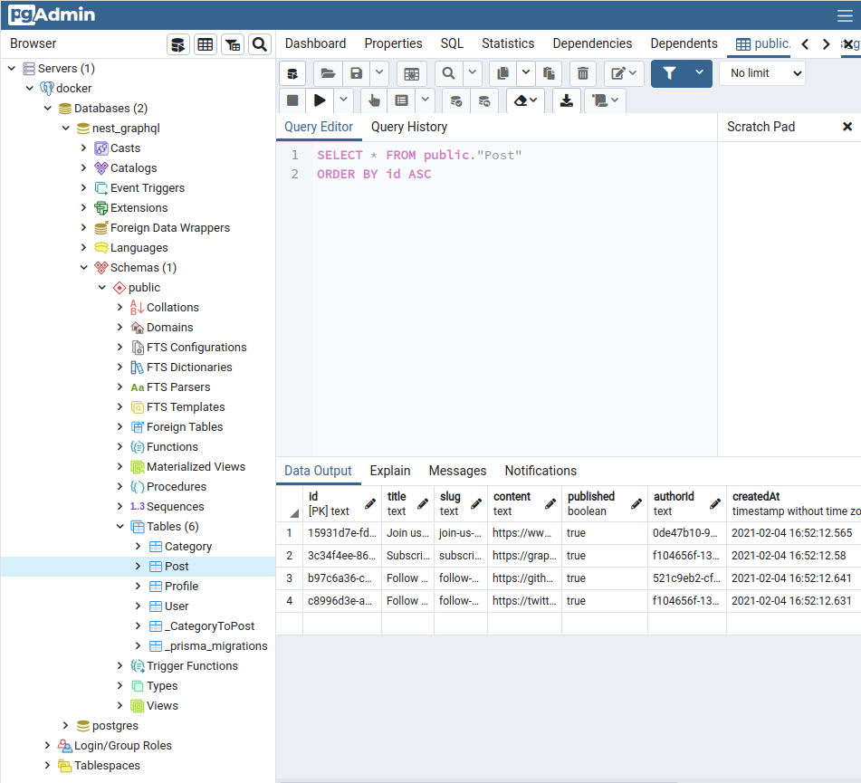

# NestJS - GraphQL - Prisma

<div align="center">
  <a href="http://nestjs.com/" target="blank"></a>
</div>

<div align="center">
Example backend <a href="https://nestjs.com/">NestJS</a> - <a href="https://graphql.org/">GraphQL</a> project using <a href="https://prisma.io/">Prisma 2</a> & <a href="https://postgresql.org/" >PostgreSQL</a>

</div>


---

**Table of contents**

<details>
<summary>Click here to expand</summary>

- [NestJS - GraphQL - Prisma](#nestjs---graphql---prisma)
  - [Features](#features)
  - [Prerequisites](#prerequisites)
  - [Getting started](#getting-started)
    - [Installation](#installation)
    - [Command lines](#command-lines)
  - [Project structure](#project-structure)
    - [Tree project](#tree-project)
    - [Structure details](#structure-details)
  - [Resolvers of Project (Endpoints)](#resolvers-of-project-endpoints)
  - [Docker](#docker)
    - [Command line](#command-line)
    - [PgAdmin4](#pgadmin4)
  - [Todo](#todo)
  - [Thanks](#thanks)


</details>


## Features

I create this repo for learning, practicing and understanding how to work NestJS, GraphQL & Prisma together. Project also how to build a clean architecture scalable & testable.

Project inspired from [Nestjs-prisma-starter](https://github.com/fivethree-team/nestjs-prisma-starter) of [fivethree-team](https://github.com/fivethree-team).

Features of project:

- GraphQL with [apollo-server-express](https://github.com/apollographql/apollo-server), solution [code first](https://docs.nestjs.com/graphql/quick-start#code-first) and using [GraphQL play ground](https://github.com/graphql/graphql-playground)
- Using [PostgreQL](https://github.com/brianc/node-postgres) for database and [Prisma 2](https://github.com/prisma/prisma) as ORM
- CRUD operations, database relationship, pagination
- [NestJS Authentication](https://docs.nestjs.com/security/authentication) with [Passport](https://github.com/jaredhanson/passport), [JWT](http://www.passportjs.org/packages/passport-jwt/), [Bcrypt](https://github.com/kelektiv/node.bcrypt.js/) encrypted password and refresh token JWT
- Rating limit API with [express-rate-limit](https://github.com/nfriedly/express-rate-limit)
- Verification email for register
- Docker solution for PostgreSQL, PGAdmin, Prisma
- Next generation Typescript
- Testing: Unit testing, End to End testing
- Database seeding
- Role base system: Admin & User
- CI-CD with circle-ci

## Prerequisites

If you want to develop project only on your local, your need have:
- [NodeJS](https://nodejs.org/en/download/): I use NodeJS lts version (14.15.1)
- npm or yarn: [yarn](https://classic.yarnpkg.com/en/docs/install/#debian-stable) recommend
- [@prisma/cli](https://www.prisma.io/docs/concepts/components/prisma-cli/installation)
- [PostgreSQL](https://www.postgresql.org/download/)
- [PgAdmin(optional)](https://www.pgadmin.org/download/): UI tool to manage database from PostgreSQL

If you don't want to install all this tools, you can check the [docker solution](#docker) below.
## Getting started

### Installation

- Clone project from this repository
- Create and update `.env` file for variables environment
  ```bash
  $ cp .env.example .env
  ```

  Then modify the variables as you want.

  Example of `.env` files:
  ```env
  SERVER_PORT=1776
  DB_CONNECTOR=postgres
  DB_HOST=postgres
  DB_USER=postgres
  DB_PASSWORD=postgres
  DB_DATABASE=nest_graphql
  DB_PORT=5432
  PGADMIN_DEFAULT_EMAIL=admin@admin.com
  PGADMIN_DEFAULT_PASSWORD=admin


  DATABASE_URL=postgresql://${DB_USER}:${DB_PASSWORD}@${DB_HOST}:${DB_PORT}/${DB_DATABASE}?schema=public
  ```
- Install dependencies
  ```bash
  $ yarn
  # or npm install
  ```
- Generate prisma schema
  Make sure you generate prisma schema before run server:
  ```bash
  $ yarn prisma generate
  ```

  Check [Prisma Client](https://www.prisma.io/docs/concepts/components/prisma-client) for more details how `prisma generate works`

- Run server locally
  ```bash
  $ yarn start:dev
  # or npm run start:dev
  ```

### Command lines

Other useful commands to work with project:
- Run production
  ```ts
  $ yarn start:prod
  ```
- Run testing:
  ```bash
  $ yarn test # for running the the Unit $ integration testing
  $ yarn test:e2e  # for running end to end testing
  ```
- Prisma migrate
  [Prisma migrate](https://www.prisma.io/docs/concepts/components/prisma-migrate) is an imperative database schema migration tool that enables you to make changes to your database schema.

  Migrate auto your schema:
  ```bash
  $ yarn prisma migrate dev --preview-feature
  ```

  Migrate with the name schema:
  ```bash
  $ yarn prisma migrate dev --name initDb --preview-feature
  ```

  When we run `prisma generate` or `prisma migrate`, `prisma/cli` will try connect with your database first. So you need to connect successfully with your database through your variable `DATABASE_URL` given in `prisma.schema`:

  For example, you have configuration in your `prisma.schema` like below:

  ```prisma
  // prisma.schema
  datasource db {
    provider = "postgresql"
    url      = env("DATABASE_URL")
  }
  ```

  So you need to provide this value in `.env` file:

  ```
  DB_HOST=postgres
  DB_USER=postgres
  DB_PASSWORD=postgres
  DB_DATABASE=nest_graphql
  DB_PORT=5432
  DATABASE_URL="postgresql://${DB_USER}:${DB_PASSWORD}@${DB_HOST}:${DB_PORT}/${DB_DATABASE}?schema=public"

  ```

  Check more information at [Prisma migrate](https://www.prisma.io/docs/concepts/components/prisma-migrate)

- Seeding database(optional)

  ```bash
  $ yarn seed
  ```
- Prisma studio
  A Visual Interface for Your Database
  [Prisma Studio](https://www.prisma.io/blog/prisma-studio-3rtf78dg99fe) helps developers manage their application data. We're excited to share that it is now part of the stable Prisma release. Try out the [online demo](https://prisma.studio/) or connect it to your existing database.

  So with Prisma studio, you maybe don't need **pgAdmin** anymore.
  <div align="center">
    
  </div>

  Ton run Prisma studio:
  ```bash
  $ yarn prisma:studio
  # or npx prisma studio
  # or yarn prisma studio
  ```
  Then check out at http://localhost:5555


  You can check more other commands in section `scripts` of `package.json`.

## Project structure

### Tree project

<details>
<summary>Click to expand sections</summary>

```tree
.
├── docker
│   ├── Dockerfile
│   ├── Dockerfile.prod
│   └── nginx
│       ├── Dockerfile.nginx
│       └── nginx.conf
├── docker-compose.production.yml
├── docker-compose.test.yml
├── docker-compose.yml
├── graphql
├── jest.config.js
├── LICENSE
├── nest-cli.json
├── package.json
├── prisma
│   ├── migrations
│   ├── schema.prisma
│   └── seed.ts
├── README.md
├── src
│   ├── app
│   │   ├── app.controller.ts
│   │   ├── app.module.ts
│   │   ├── app.resolver.ts
│   │   ├── app.service.ts
│   ├── common
│   │   ├── abstract-model
│   │   ├── configs
│   │   ├── @generated
│   │   │   ├── category
│   │   │   ├── post
│   │   │   ├── prisma
│   │   │   ├── profile
│   │   │   └── user
│   │   └── types
│   │       └── node.d.ts
│   ├── main.ts
│   ├── modules
│   │   ├── category
│   │   ├── email
│   │   ├── post
│   │   ├── prisma
│   │   ├── profile
│   │   └── user
│   └── schema.gql
├── test
│   ├── app.e2e-spec.ts
│   └── jest-e2e.json
├── tsconfig.build.json
├── tsconfig.json
└── yarn.lock

```

</details>

### Structure details

<details>
<summary>
Click here to expand section
</summary>

- `src`:
  - `app`: contains NestJS app files
  - `common`: contains shared or general files, type, model, config ... of application
    - `@generated`: contains generated inputs graphql that match with input of prisma. Thanks [Roman Vasilev](https://github.com/unlight) for this [https://github.com/unlight/prisma-nestjs-graphql] tool.
    - `configs`: contains configurations of project  as Graphql, Prisma, TypeORM ...
    - `types`: define general types using for project here
  - `modules`: contain modules (NestJS) of projects. We separate module for each unit. Each module contains its own data like: model, interface, dto, service, controller, resolver, repository, types...
    - model
    - service
    - resolver
    - controller
    - module
    - interfaces
    - dto
    - types
    - test
    - decorator
    - args
  - `main.ts`: main file to run server
- `.vscode`: debug configuration in vscode
- `docker`: contains all files related Docker as `Dockerfile`, `nginx` (except docker-compose)
- `prisma`:  contains `prisma.shema`, migrations, and seeding
- `graphql`: contains example queries & mutations of graphql for project
- `test`: for end to end testing
- `docker-compose*.yml`: docker compose files to run different environment docker
- `.env*`: different environment variables files
- `.eslint*, prettier*, .editorconfig`: Style & format code
- `jest.config.js`: configuration for testing with jest
- `package.json`
- `tsconfig.json`: configuration for TypeScript
- `.circle-ci.yml, .travis.yml, .github/workflows`: CI-CD


</details>


## Resolvers of Project (Endpoints)

**Working in progress: Resolvers or Endpoints of project**

---
## Docker

To start working with **Docker**, you need have [Docker](https://docs.docker.com/engine/install/) installed locally and also the package manage as **npm** ro **yarn**

In the **development** mode, we have already **PostgreSQL** and **PgAdmin4** in our `docker-compose` file. You can use the same values environment in your `.env` like before.

### Command line

I think all of you know already how to run docker with `docker-compose`:
We have some simple commands:

```bash
$ docker-compose build # Build all services in docker-compose.yml file
$ docker-compose up # Run all services in docker-compose.yml
$ docker-compose down # Stop all services
$ docker-compose up nest-api # Run only a  service
```

But that is not the think I want to say here, we need work with docker like we work locally as `prisma generate`, `prisma migration`, seeding, run test ...
In that case how it work?

Well we  will run directly docker-compose file for our service `nest-api` and with `yarn` or `npm` we use as when we work locally.

```
$ docker-compose -f docker-compose.yml run --rm nest-api yarn prisma:generate
```
  - `-f`: file --> using with the name `docker-compose.***.yml` file
  - `--rm`: flag to stop automatically docker service after executing.
  - `nest-api`: name service of our server (specify in docker-compose file)
  - `yarn prisma:generate`: command that we want to execute

But if you always write command like that, it will be take a lot of time and difficult to remember. So we will prepare theme in section `scripts` of `package.json`.

**Scripts of package.json**
```json
{
  "script":{
    // .....
    "docker:build": "docker-compose -f docker-compose.yml build --no-cache",
    "docker:prisma:generate": "docker-compose -f docker-compose.yml run --rm nest-api yarn prisma:generate",
    "docker:migrate": "docker-compose -f docker-compose.yml run --rm nest-api yarn migrate:dev",
    "docker:seed": "docker-compose -f docker-compose.yml run --rm nest-api yarn seed",
    "docker:prisma:studio": "docker-compose -f docker-compose.yml run nest-api -d yarn prisma:studio",
    "docker:start:dev": "docker-compose up",
    "docker:test:seed": "docker-compose -f docker-compose.test.yml run --rm nest-api yarn seed",
    "docker:test:migrate": "docker-compose -f docker-compose.test.yml run --rm nest-api yarn migrate:dev",
    "docker:test:build": "docker-compose -f docker-compose.test.yml build --no-cache",
    "docker:test:run": "docker-compose -f docker-compose.test.yml run --rm nest-api yarn test"

  }
}

```
--> You can write your own scripts to work better with docker.

**Hint**: For this moment **integration testing** or **end to end testing** with Prisma is quite difficult for me. Because `env(DATABASE_URI)` take the variable only in `.env` file. I don't want to change manually it when I want to run integration test and e2e test, so I think Docker is very good solution to solve this issue.

**Hint**: You can check [Portainer tool](https://www.portainer.io/) to manage easier multiple docker services. I think you will find it useful too.

### PgAdmin4

A little information to start with docker PgAdmin.

PgAdmin4 is database management tool for PostgreSQL. Because it is a web application based, so PgAdmin is work really well with docker. We can access directly from our browser.

After running successfully server with docker, we will open `http://localhost:8080` (Port `8080` is port specified for PgAdmin in `docker-compose` file).

If you remember, in `.env` file, we have the variables of PgAdmin:
```
PGADMIN_DEFAULT_EMAIL=admin@admin.com
PGADMIN_DEFAULT_PASSWORD=admin
```
We  will use these credentials to connect our PgAdmin.


<div align="center">


</div>


---

## Todo

- [ ] Integrate with REST API
- [ ] Mailer service
- [ ] CI-CD
- [ ] End to end testing
- [ ] Multi-language with i18n options
- [ ] Add model subscribers
- [ ] Integrate with AWS service (S3, RDS)
- [ ] Caching with Redis
- [ ] ...
## Thanks
